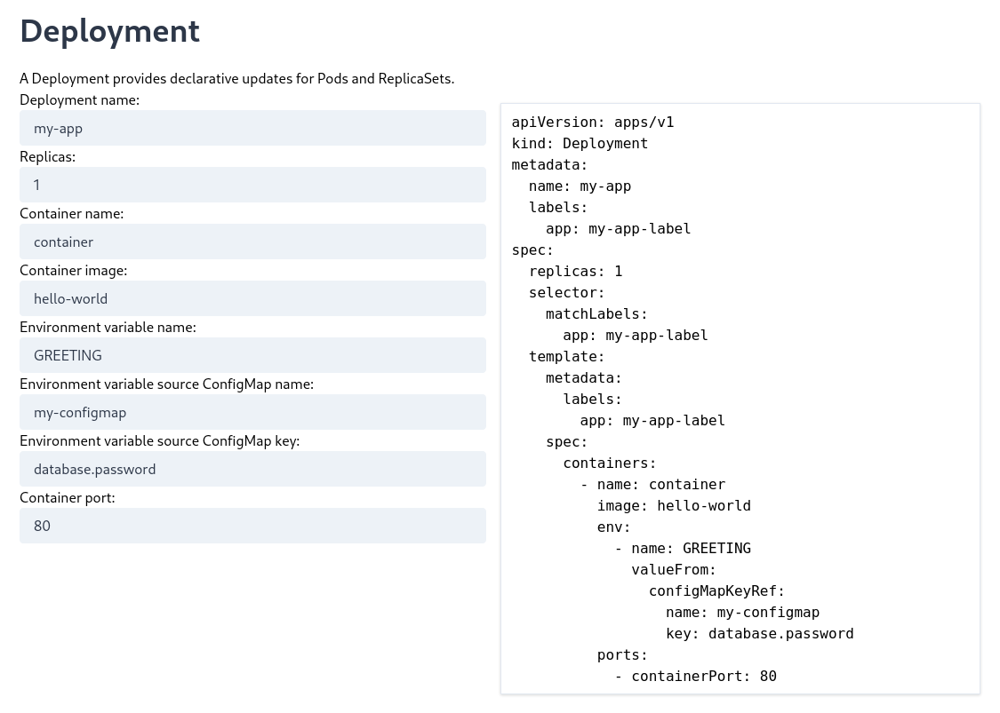

# Kubernetes Manifest Builder

🔎 **A single-page web application for creating Kubernetes resource definitions (JSON/YAML manifests).** Built with: VueJS, TailwindCSS, sweat+tears.

🍏 Use the live instance on [my blog](https://tomd.xyz) at: https://tomd.xyz/tools/kubernetes-manifest-builder/



> This is a personal project, developed when I realised I was fed up of writing Kubernetes manifests all the time. This project is also my playground for learning modern front-end development (I'm normally a back-end engineer so this is a bit of a change for me!) 👴 I don't work on this project regularly but will be coming back to it infrequently to update and add new features. Your issues and pull requests are welcome!

**Latest news (25/10/2020):** I've built this very early prototype, which outputs YAML or JSON, depending on the values you type into a form. Now I'm researching how to create and populate forms dynamically from JavaScript objects, so that more dynamic and complex Kubernetes objects can be created.

## Future roadmap

- Support for more fields in the core objects (Pod, Deployment, Service)
- Support for dynamic fields in objects (e.g. environment variables, volumes)
- Combine multiple objects into a Kubernetes List or OpenShift Template
- Support for creating Helm charts
- Make it look nicer

## Project setup

If you want to build and run this application locally, you'll need NPM installed:

```
npm install
```

Compile and hot-reload for development (starts a web server and enables hot-reload):

```
npm run serve
```

Compile and minify for production (builds the application into the `dist/` folder):

```
npm run build
```

Do some linting or something:

```
npm run lint
```

## Licence

(c) 2020 Tom Donohue and authors. This software is shared here under the [GPL-3.0 License](LICENSE). You are free to copy, distribute or modify, by following the terms of the licence.

